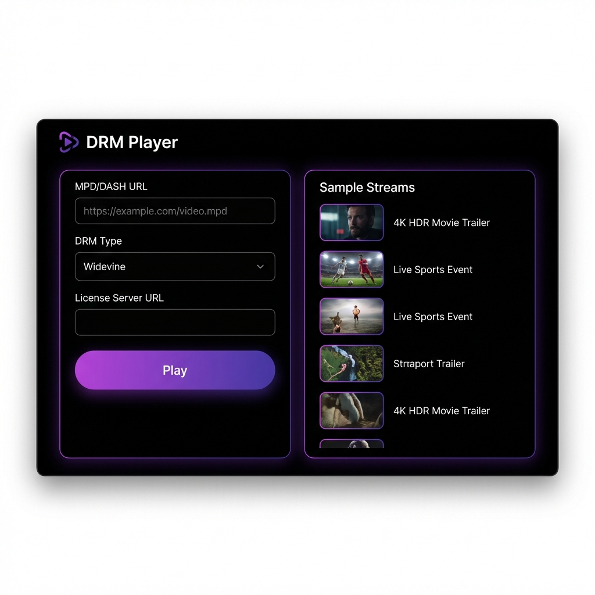
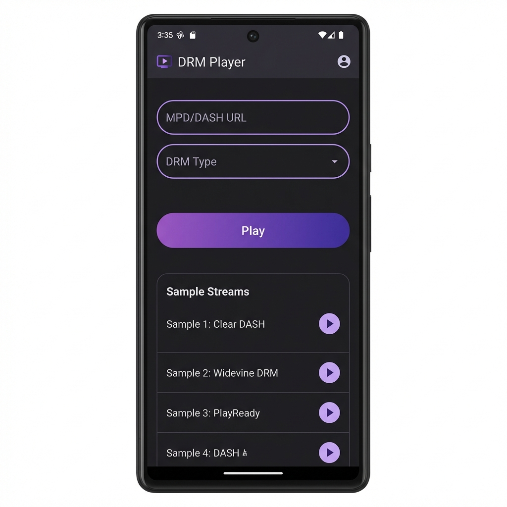
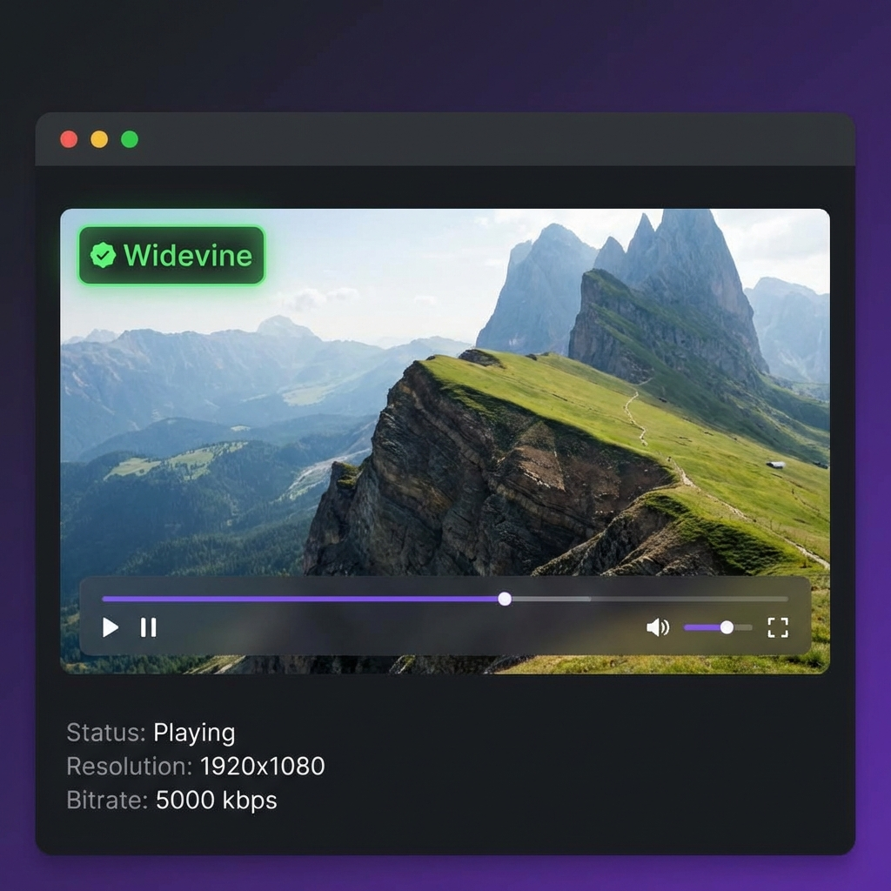

# DRM Player

<p align="center">
  
</p>

**A modern, cross-platform DRM video player supporting Widevine and ClearKey encryption.**

[](https://github.com/DRMSTREAMER/drm-player/actions/workflows/release.yml)
[](https://opensource.org/licenses/MIT)

---

## ✨ Features

- 🎬 **DASH/MPD** streaming support
- 🔐 **Widevine DRM** with license server configuration
- 🔑 **ClearKey DRM** with manual key input
- 🖥️ **Desktop App** (Windows, macOS, Linux)
- 📱 **Android App** (Mobile & TV)
- 🌙 **Modern Dark Theme** with gradient accents
- ⚡ **Sample Streams** included for testing

---

## 📸 Screenshots

<p align="center">
  
  &nbsp;&nbsp;&nbsp;
  
</p>

---

## 🚀 Quick Start

### Desktop (Electron)

```bash
cd drm-player
npm install
npm start
```

#### Build for Distribution

```bash
npm run build:win    # Windows
npm run build:mac    # macOS  
npm run build:linux  # Linux
```

### Android

Open `android-drm-player/` in Android Studio, or build from command line:

```bash
cd android-drm-player
./gradlew assembleDebug
```

Install: `app/build/outputs/apk/debug/app-debug.apk`

---

## 🎯 Sample Streams

| Name | DRM | License Server |
|------|-----|----------------|
| [Angel One (Clear)](https://storage.googleapis.com/shaka-demo-assets/angel-one/dash.mpd) | None | - |
| [Angel One (Widevine)](https://storage.googleapis.com/shaka-demo-assets/angel-one-widevine/dash.mpd) | Widevine | `https://cwip-shaka-proxy.appspot.com/no_auth` |
| [Envivio (Clear)](https://dash.akamaized.net/envivio/EnvisivoDash3/manifest.mpd) | None | - |

---

## 🛠️ Technology

| Platform | Library |
|----------|---------|
| Desktop | [Shaka Player](https://github.com/shaka-project/shaka-player) + Electron |
| Android | [ExoPlayer/Media3](https://developer.android.com/jetpack/androidx/releases/media3) |

---

## 📦 Downloads

Get the latest release from [GitHub Releases](https://github.com/drmstreamer/drm-player/releases).

| Platform | Download |
|----------|----------|
| Windows | `DRM-Player-Setup.exe` |
| macOS | `DRM-Player.dmg` |
| Linux | `DRM-Player.AppImage` |
| Android | `drm-player.apk` |

---

## 📞 Contact

- **Telegram:** [@drmstreamer](https://t.me/drmstreamer)
- **Website:** [https://drmstreamer.com](https://drmstreamer.com)

---

## 📄 License

MIT License - Copyright (c) 2026 DRM Streamer

See [LICENSE](LICENSE) for details.

---

<p align="center">
  Made with ❤️ by <a href="https://drmstreamer.com">DRM Streamer</a>
</p>

